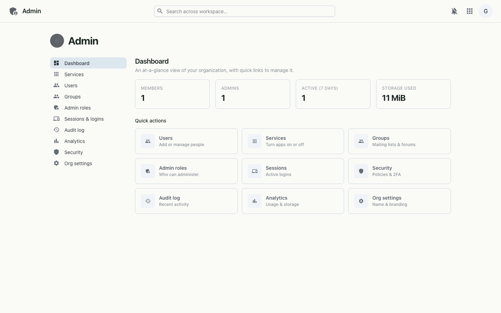

# Admin

Organization admin console — members, admins, services toggles, admin roles, audit log, analytics, security policies, and org settings. Shows live metrics (members, storage used).

## Desktop

---

_Live-captured at `http://workspace.localtest.me:8080/admin` against the local full stack, authenticated as `admin@grown.localtest.me` via Zitadel SSO._
