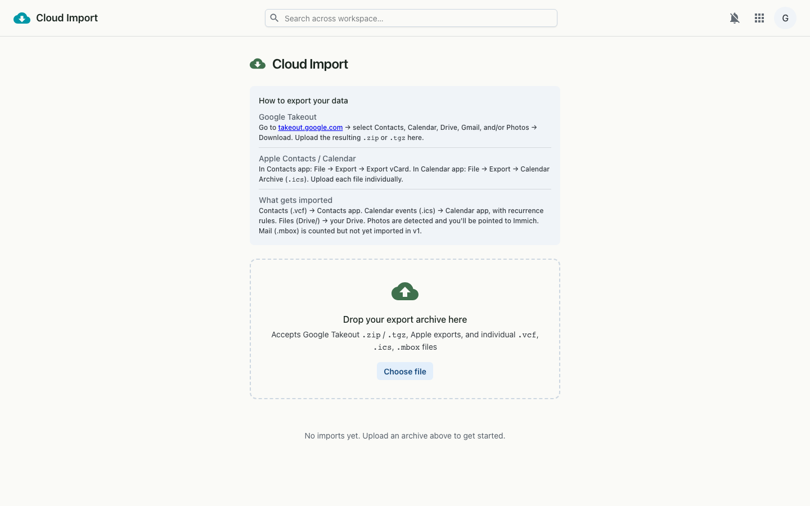

# Cloud Import

Import data and files from external cloud providers (e.g. Google) into the workspace.

## Desktop

---

_Live-captured at `http://workspace.localtest.me:8080/cloudimport` against the local full stack, authenticated as `admin@grown.localtest.me` via Zitadel SSO._
