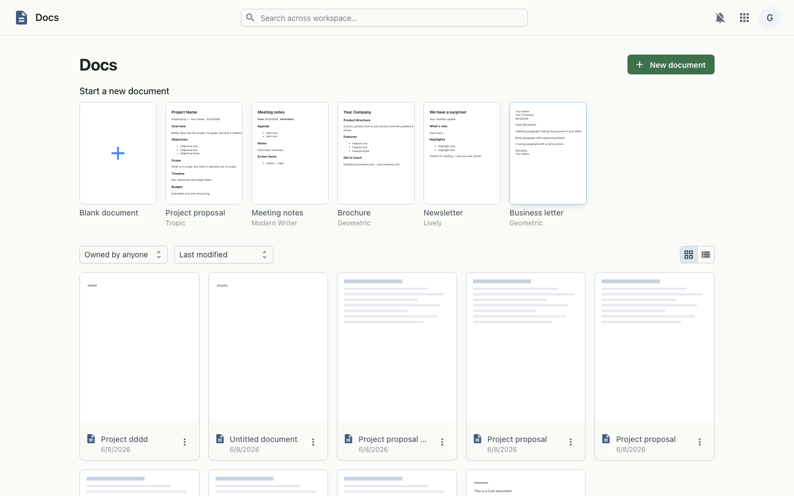
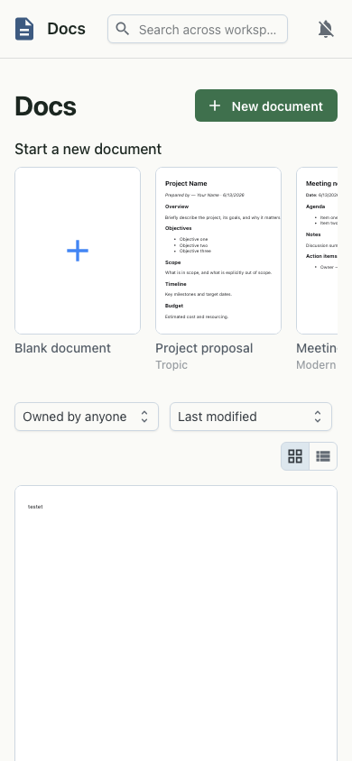

# Docs

Collaborative rich-text documents with starter templates (project proposal, meeting notes, brochure, newsletter, business letter) and a list of existing documents.

## Keyboard shortcuts

Help ▸ Keyboard shortcuts (Ctrl+/) lists every shortcut and switches the
**shortcut style**; the same choice is in Settings ▸ Keyboard shortcuts. It is
saved per user (it follows you to other devices) and applies at once. On a Mac,
Ctrl means ⌘ and Alt means Option.

- **Microsoft Word style** (the default) keeps every Grown shortcut and adds
  Word's own: Ctrl+L / Ctrl+E / Ctrl+R / Ctrl+J align left / centre / right /
  justify, Ctrl+= subscript, Ctrl+Shift+= superscript, Ctrl+Shift+G word count,
  F7 spelling. Strikethrough is Ctrl+Shift+S.
- **Google Docs style** follows Google Docs: Alt+Shift+5 strikethrough,
  Ctrl+Alt+X spelling, and none of the Word-only chords above (Ctrl+E is then
  TipTap's inline code; Ctrl+L / R / J and Ctrl+= go to the browser).

Shared by both: Ctrl+Shift+L / E / R / J alignment, Ctrl+Shift+7 / 8 numbered
and bulleted lists, Ctrl+Alt+0 normal text and Ctrl+Alt+1…6 headings, Ctrl+. /
Ctrl+, superscript / subscript, Ctrl+Shift+. / Ctrl+Shift+, font size, Ctrl+\\
clear formatting, Ctrl+Space reset character formatting, Ctrl+] / Ctrl+[ and
Ctrl+M / Ctrl+Shift+M indent, Ctrl+Alt+M comment, Ctrl+Shift+C word count,
Ctrl+K link, Alt+X hex to character.

Not bound, and why:

- Word's Ctrl+Shift+L (List Bullet) and Ctrl+] / Ctrl+[ (font size) would take
  over long-standing Grown chords (align left, indent); Word's other font-size
  chords, Ctrl+Shift+. / Ctrl+Shift+, (Ctrl+Shift+> / <), work.
- Word's Ctrl+D (Font dialog): Docs has no Font dialog.
- Word's Ctrl+Shift+N (Normal style), Ctrl+T / Ctrl+Shift+T (hanging indent)
  and Ctrl+N / Ctrl+W: browsers keep these (new window, tabs); use Ctrl+Alt+0
  for normal text.
- Google's Ctrl+Shift+S (voice typing): no voice typing yet, so it does nothing
  in the Google style (and is strikethrough in the Word style).

## Desktop

## Mobile

---

_Live-captured at `http://workspace.localtest.me:8080/docs` against the local full stack, authenticated as `admin@grown.localtest.me` via Zitadel SSO._
