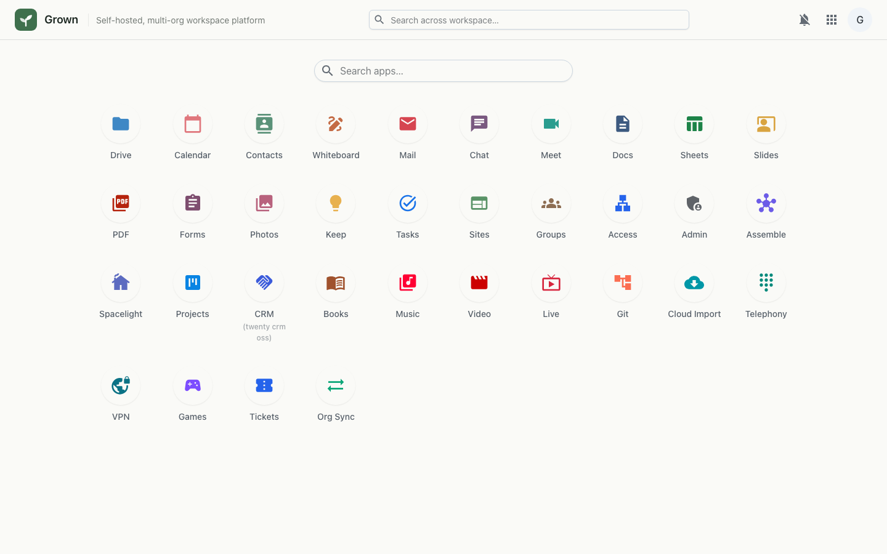
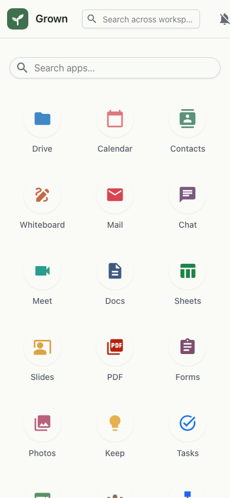

# Drive (App Launcher & Files)

The home screen and app launcher for the whole workspace — a grid of every installed app plus the user's files. This is the landing page after sign-in.

## Desktop

## Mobile

---

_Live-captured at `http://workspace.localtest.me:8080/` against the local full stack, authenticated as `admin@grown.localtest.me` via Zitadel SSO._
