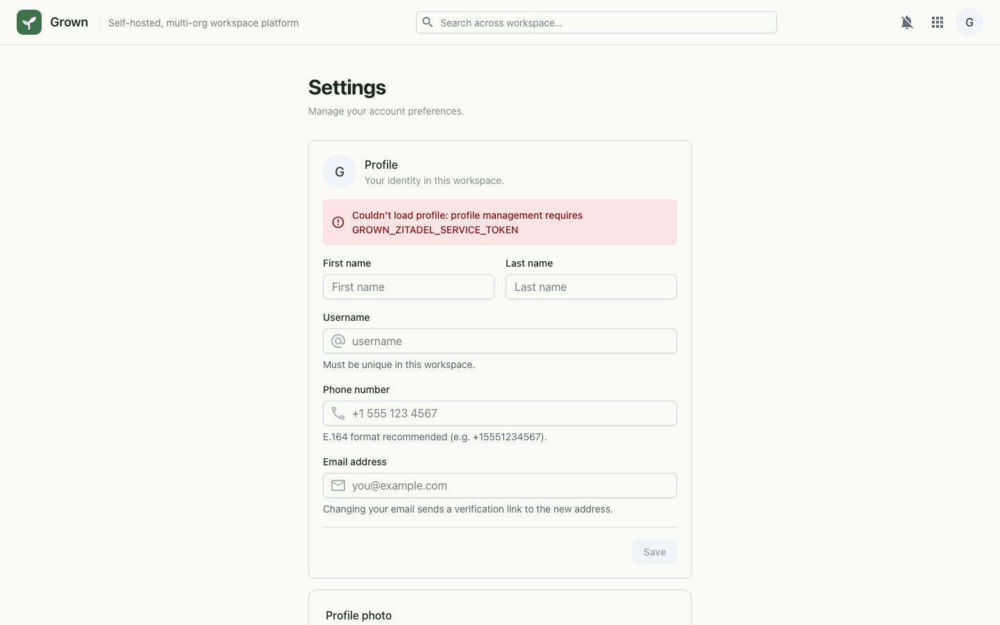

# Settings

Per-user workspace settings — profile, appearance, notifications, and the
keyboard shortcut style for Docs and Sheets (Microsoft Office style, the
default, or Google style). The shortcut style is stored in the user's
preferences (`docs_shortcut_scheme` / `sheets_shortcut_scheme` in the `extra`
bag of `/api/v1/me/preferences`) and can also be switched from each editor's
Help ▸ Keyboard shortcuts dialog.

## Desktop

---

_Live-captured at `http://workspace.localtest.me:8080/settings` against the local full stack, authenticated as `admin@grown.localtest.me` via Zitadel SSO._
