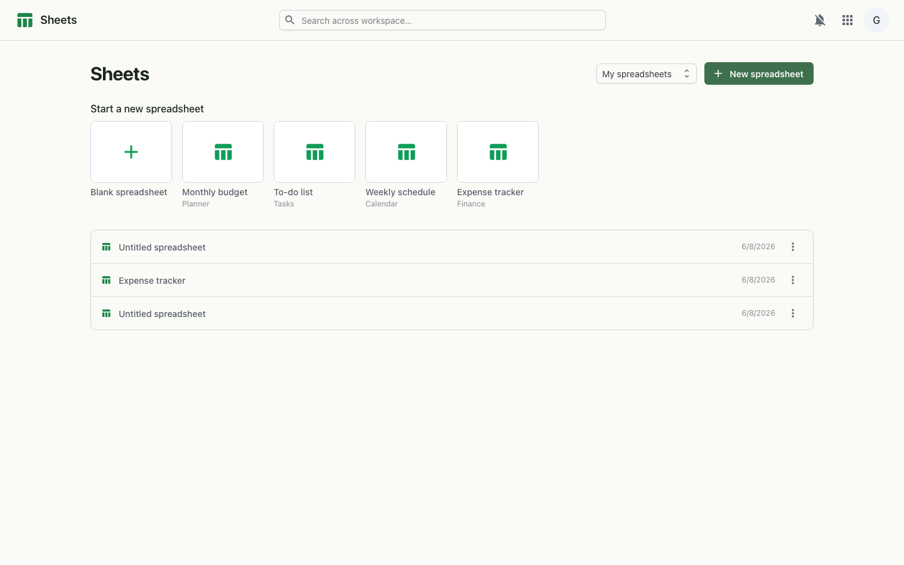
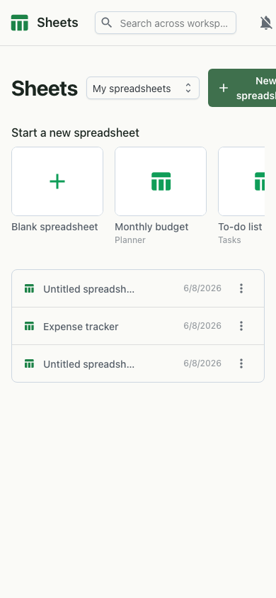

# Sheets

Collaborative spreadsheets with templates (monthly budget, to-do list, weekly schedule, expense tracker) and recent files.

## Keyboard shortcuts

Help ▸ Keyboard shortcuts (Ctrl+/) lists every shortcut and switches the
**shortcut style**; the same choice is in Settings ▸ Keyboard shortcuts. It is
saved per user and applies at once. On a Mac, Ctrl means ⌘ and Alt means
Option.

| Action | Microsoft Excel style (default) | Google Sheets style |
|---|---|---|
| Strikethrough | Ctrl+5 (and Alt+Shift+5) | Alt+Shift+5 |
| Format cells (number format) | Ctrl+1 | — |
| Paste special… | Ctrl+Alt+V | — |
| Insert rows (columns when whole columns are selected) | Ctrl+Shift+= | Ctrl+Alt+= |
| Delete rows (columns when whole columns are selected) | Ctrl+- | Ctrl+Alt+- |
| Hide rows / columns | Ctrl+9 / Ctrl+0 | Ctrl+Alt+9 / Ctrl+Alt+0 |
| Align left / centre / right | — | Ctrl+Shift+L / E / R |
| Filter on/off | Ctrl+Shift+L | — |
| Table total row | Ctrl+Shift+R | — |
| Insert table | Ctrl+L / Ctrl+T | Ctrl+Alt+T |

Shared by both: Ctrl+Shift+V paste values, Ctrl+D / Ctrl+R fill down / right,
Ctrl+Shift+9 / Ctrl+Shift+0 unhide rows / columns, Ctrl+Space / Shift+Space
select column / row, Ctrl+Alt+M and Shift+F2 comment (Grown has no separate
notes), Ctrl+Shift+1…6 number formats, and the rest of the list.

Not bound, and why:

- Borders (Google's Alt+Shift+1…7, Excel's Ctrl+Shift+& / Ctrl+Shift+_): the
  grid (FortuneSheet) offers no way to set borders from outside its toolbar;
  use the toolbar's border menu.
- Excel's Ctrl+Shift+= / Ctrl+- open an Insert / Delete dialog for a partial
  selection; Grown inserts or deletes whole rows (or whole columns when whole
  columns are selected), as Google Sheets does.
- Ctrl+T, Ctrl+W, Ctrl+N and (in some browsers) Ctrl+0…9 belong to the browser,
  which may act before the page sees them; Ctrl+Space / ⌘+Space may be taken
  by the operating system's input switcher or Spotlight.

## Desktop

## Mobile

---

_Live-captured at `http://workspace.localtest.me:8080/sheets` against the local full stack, authenticated as `admin@grown.localtest.me` via Zitadel SSO._
